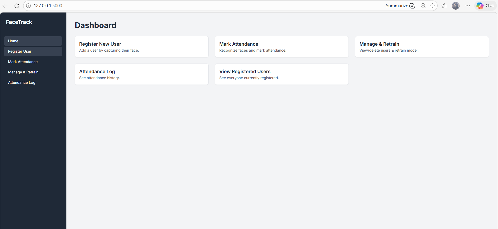
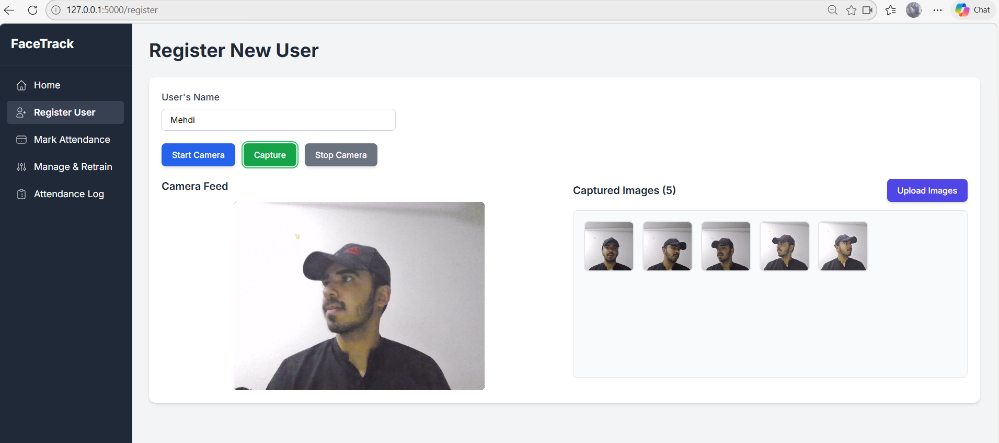
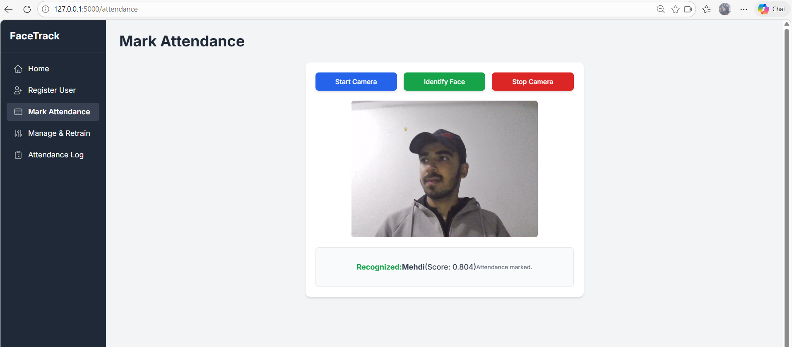
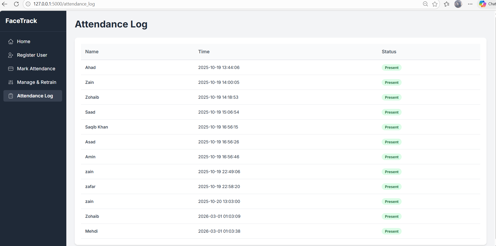
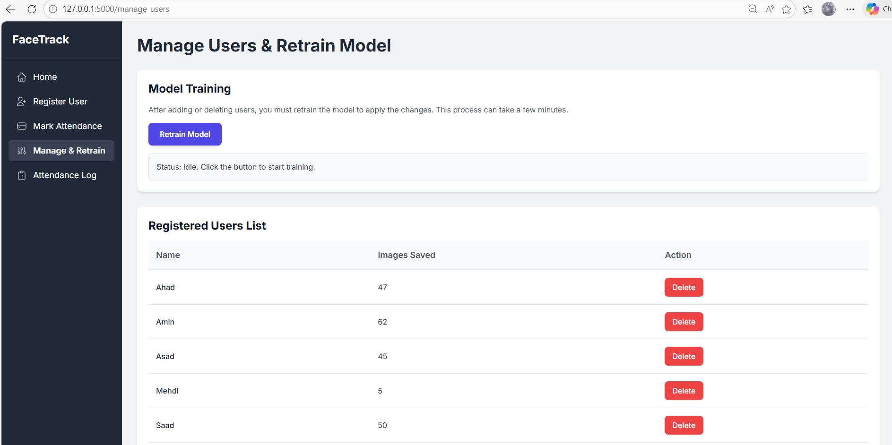

# 🧠 Face Recognition Attendance System

<p align="center">
  
  
  
  
  
</p>

<p align="center">
  <strong>Deep Learning–Based Facial Recognition Attendance System</strong><br/>
  <em>Lab Mid Project &nbsp;|&nbsp; BCS-5B &nbsp;|&nbsp; COMSATS University Islamabad &nbsp;|&nbsp; October 2025</em>
</p>

---

## 📋 Table of Contents

- [Problem Statement](#-problem-statement)
- [Features](#-features)
- [Tech Stack](#-tech-stack)
- [Project Structure](#-project-structure)
- [Getting Started](#-getting-started)
- [Usage](#-usage)
- [Results](#-results)
- [Future Improvements](#-future-improvements)
- [Contributors](#-contributors)

---

## 🚩 Problem Statement

Traditional attendance methods — manual roll calls and RFID card systems — are slow, error-prone, and vulnerable to proxy attendance. This project replaces them with a **contactless, AI-powered facial recognition system** that is fast, accurate, and difficult to spoof.

---

## ✨ Features

| Feature | Details |
|---|---|
| 📸 Webcam Registration | Register users live via webcam (minimum 5 photos required) |
| ⚡ Real-Time Recognition | Marks attendance in **~200ms per person** |
| 📋 Attendance Logs | View registered users and full attendance history |
| 🎥 Offline Bulk Capture | `capture_dataset.py` for offline dataset collection |
| 🔄 One-Click Retrain | Re-extract embeddings and retrain the classifier in one command |
| 📱 Mobile-Ready | TFLite model (~1MB) for potential Android deployment |

---

## 🛠 Tech Stack

**Backend**
- [Flask](https://flask.palletsprojects.com/) — lightweight Python web framework
- [DeepFace](https://github.com/serengil/deepface) with **FaceNet** — face embedding extraction
- [OpenCV](https://opencv.org/) with **Haar Cascade** — real-time face detection

**Frontend**
- HTML5 + JavaScript
- [Tailwind CSS](https://tailwindcss.com/) — responsive UI styling
- WebRTC Webcam API — live video capture in the browser

**Data & ML**
- [NumPy](https://numpy.org/) — numerical operations
- [Pandas](https://pandas.pydata.org/) — attendance log management
- [scikit-learn](https://scikit-learn.org/) — classifier training (SVM / k-NN)

**Utility Scripts**

| Script | Purpose |
|---|---|
| `capture_dataset.py` | Offline bulk photo capture for a user |
| `extract_embeddings.py` | Generate FaceNet embeddings from dataset |
| `convert_to_tflite.py` | Convert trained model to TFLite for mobile |

---

## 📁 Project Structure

```
face-attendance-system/
├── app.py                    # Flask application entry point
├── requirements.txt          # Python dependencies
├── capture_dataset.py        # Offline dataset capture script
├── extract_embeddings.py     # Embedding extraction script
├── convert_to_tflite.py      # TFLite conversion script
│
├── templates/                # HTML templates (Jinja2)
│   ├── index.html
│   ├── register.html
│   └── attendance.html
│
├── static/                   # CSS, JS, and assets
│   └── ...
│
├── data/                  # User face images (not included — see note below)
│   └── <username>/
│       └── *.jpg
│
├── embeddings/               # Extracted face embeddings (.pkl)
├── model/                   # Trained classifier + TFLite model
├── logs/                     # Attendance CSV logs
└── docs/                     # Full report and presentation slides
```

> **🔒 Privacy Note:** No sample photos are included in this repository. Use the `/register` web page or `capture_dataset.py` to build your own dataset.

---

## 🚀 Getting Started

### Prerequisites

- Python 3.8+
- A working webcam
- Git

### Installation

```bash
# 1. Clone the repository
git clone https://github.com/AbbasZain12/face-attendance-system.git
cd face-attendance-system

# 2. Create and activate a virtual environment
python -m venv env

# Windows
env\Scripts\activate

# macOS / Linux
source env/bin/activate

# 3. Install dependencies
pip install -r requirements.txt

# 4. Run the application
python app.py
```

Then open your browser and navigate to **http://127.0.0.1:5000**

---

## 📖 Usage

### Register a New User
1. Go to **http://127.0.0.1:5000/register**
2. Enter the user's name and ID
3. Capture at least **5 photos** using the webcam
4. Click **"Train Model"** to update the classifier

### Mark Attendance
1. Go to **http://127.0.0.1:5000** (Home / Live Feed)
2. The system automatically detects and recognizes faces in real time
3. Attendance is logged with a timestamp

### Offline Dataset Capture
```bash
python capture_dataset.py --name "John Doe" --samples 30
```

### Retrain the Model
```bash
python extract_embeddings.py
```

---

## 📊 Results

| Metric | Value |
|---|---|
| **Recognition Accuracy** | 95% |
| **Inference Time (CPU)** | ~200ms per face |
| **Test Users** | 10 |
| **Images Tested** | 50+ |
| **Hardware** | Intel Core i5 (CPU only) |
| **Test Date** | October 2025 |

📄 **Full Report & Presentation** → [`docs/`](./docs/)

---
## 📸 Screenshots

<p align="center">
  
  
</p>

<p align="center">
  
  
</p>

<p align="center">
  
</p>

## 🔮Future Improvements
- [ ] Upgrade to **MediaPipe** or **RetinaFace** for more robust face detection
- [ ] Add **anti-spoofing** (liveness detection) to prevent photo-based attacks
- [ ] Integrate **SQLite database** with user login and role management
- [ ] Develop a full **Android app** using the TFLite model
- [ ] Add **email/SMS notifications** for attendance reports

---

## 👥 Contributors

| Name | Student ID |
|---|---|
| **M Zain Abbas** | FA23-BCS-079 |
| **Zohaib Hassan** | FA23-BCS-080 |

**Course:** Computer Vision / AI Lab — BCS-5B  
**Institution:** COMSATS University Islamabad  
**Submitted:** 21 October 2025

---

<p align="center">
  Made with ❤️ at COMSATS University Islamabad
</p>
